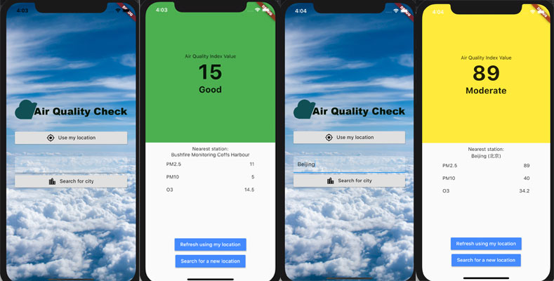

# Air Quality

An app that displays the current air quality of a given location.


## Status

In progress.

## Technology
Built using Dart and Flutter.

## Current Features

* Gets the user's location
* Displays the AQI value
* Displays the AQI level
* Displays the nearest monitoring station to the user

## Future Features

* A user can search for a location to get the air quality data
* Display PM2.5 level
* Display PM10 level
* Display O3 level
* Display NO2 level
* Display temperature
* Display humidity

## Data

The data is taken from the API provided by the [World Air Quality Index project](https://aqicn.org/).

## External Libraries Used
* [http](https://pub.dev/packages/http)
* [geolocator](https://pub.dev/packages/geolocator)

## Setup

To get the external libraries used:
````bash
$ flutter pub get
````

### API Key
You will need to provide your own api key, available for free here: [https://aqicn.org/data-platform/register/](https://aqicn.org/data-platform/register/)

To include the API key in the app...
* Create an 'assets' folder in the main directory
* Create an 'api' folder in the 'assets' folder
* Create an 'apikey.json' file in the 'api' folder
* Add the following to the apikey.json file...
````json
{
  "apikey": "YOUR_API_KEY_GOES_HERE"
}
````

## Credits
Background image photo by [https://unsplash.com/@taylorvanriper925](Taylor Van Riper).